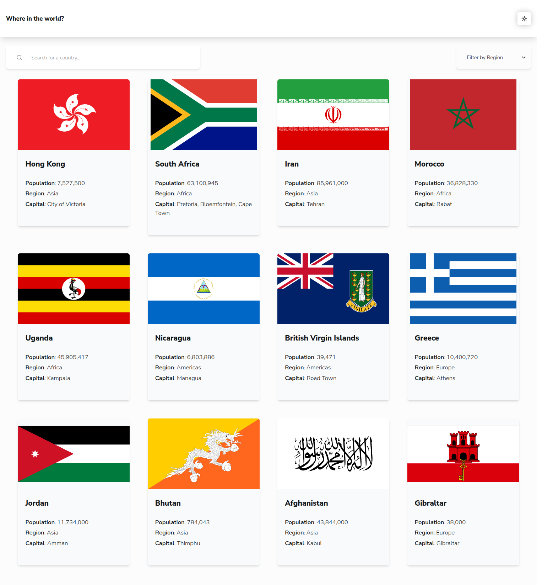
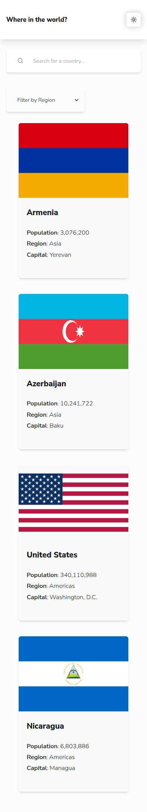

# Frontend Mentor - REST Countries API with color theme switcher solution

This is a solution to the [REST Countries API with color theme switcher challenge on Frontend Mentor](https://www.frontendmentor.io/challenges/rest-countries-api-with-color-theme-switcher-5cacc469fec04111f7b848ca). Frontend Mentor challenges help you improve your coding skills by building realistic projects.

## Table of contents

- [Overview](#overview)
    - [The challenge](#the-challenge)
    - [Screenshot](#screenshot)
    - [Links](#links)
- [My process](#my-process)
    - [Built with](#built-with)
    - [Continued development](#continued-development)
    - [Useful resources](#useful-resources)
- [Author](#author)

## Overview

### The challenge

Users should be able to:

- See all countries from the API on the homepage
- Search for a country using an `input` field
- Filter countries by region
- Click on a country to see more detailed information on a separate page
- Click through to the border countries on the detail page
- Toggle the color scheme between light and dark mode *(optional)*

### Screenshots

| Desktop View                                     | Mobile View                                    |
|--------------------------------------------------|------------------------------------------------|
|  |  |

### Links

- Solution URL: [GitHub](https://github.com/thyuhtooaung-dev/Where-in-the-world)
- Live Site URL: [Vercel](https://where-in-the-world-ecru.vercel.app/)

## My process

### Built with

- [React](https://reactjs.org/)
- [Tailwindcss](https://tailwindcss.com/)
- [ShadCN](https://ui.shadcn.com/)

### Continued Development

In the future, I plan to improve this project with the following features:

- Add a Google Maps feature for every country
- Make the cards smoother using Motion.dev animations
- Add a "Back to Top" button for mobile devices so users can return to the top without scrolling

### Useful resources

- [shadcn/ui Documentation](https://ui.shadcn.com/docs) – This resource explains how shadcn components are structured and composed. It helped me understand how to customize and extend components instead of treating them as a fixed library.

## Author

- Github - [Thyu Htoo Aung](https://github.com/thyuhtooaung-dev)
- Frontend Mentor - [@PoungMont](https://www.frontendmentor.io/profile/thyuhtooaung-dev)
- X - [@PoungMont](https://x.com/Poung_Mont)