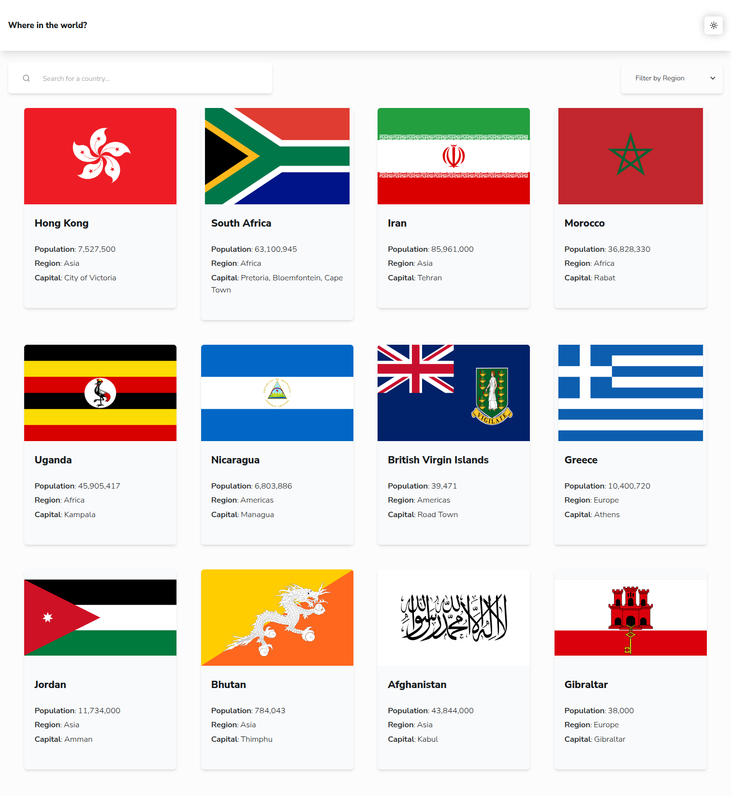
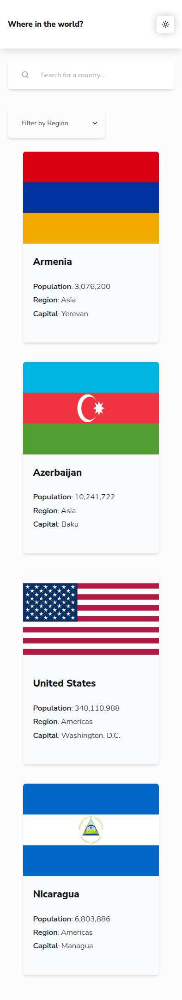

# REST Countries API with Color Theme Switching

A high-performance data visualization application that allows users to explore global geographic data. This project demonstrates advanced filtering logic, dynamic routing for deep-linking, and a robust implementation of dark/light mode using CSS variables and Tailwind CSS.

[Live Demo](https://where-in-the-world-ecru.vercel.app/) | [Source Code](https://github.com/thyuhtooaung-dev/Where-in-the-world)

## Technical Stack

* **Framework**: React (Vite)
* **Styling**: Tailwind CSS for utility-first responsive design.
* **Components**: shadcn/ui for accessible, unstyled primitives.
* **Routing**: React Router for nested navigation and country-specific detail views.
* **Data Fetching**: REST Countries API integration with optimized state handling.

---

## Key Features

### Dynamic Search and Filtering

Implemented a multi-criteria filtering system that allows users to search by country name and filter by geographic region simultaneously. The state management ensures that UI updates are fluid and results are rendered efficiently.

### Responsive Detail Views

Each country has a dedicated detail page that pulls extended data, including native names, currencies, and top-level domains.

### Border Country Navigation

The application parses border country codes into full country names, providing clickable links that allow users to navigate through adjacent nations seamlessly via dynamic route updates.

### Adaptive Theming

A comprehensive Dark Mode implementation that persists user preference and adapts to system settings, ensuring a comfortable viewing experience across different lighting conditions.

---

## Technical Implementation Details

### State Management and Performance

The application minimizes unnecessary re-renders by strategically lifting state for the search and filter components. This ensures that the country grid remains responsive even when handling data for over 250 countries.

### Component Architecture

By utilizing **shadcn/ui**, the project maintains a high standard of accessibility (A11y). Components such as the Search Input and Region Select are fully keyboard-navigable and follow WAI-ARIA patterns.

---

## Visual Overviews

| Desktop View | Mobile View |
| :--- | :--- |
|  |  |

---

## Development Roadmap

* **Geospatial Integration**: Integration of the Google Maps JavaScript API to provide interactive map views for each country.
* **Enhanced Motion**: Implementation of Motion.dev for orchestrated entrance animations and shared layout transitions.
* **UX Optimization**: Addition of a "Back to Top" navigation utility for mobile users and skeleton loading states for better perceived performance.

---

## Author

**Thyu Htoo Aung** [GitHub](https://github.com/thyuhtooaung-dev) | [Frontend Mentor](https://www.frontendmentor.io/profile/thyuhtooaung-dev) | [X / Twitter](https://x.com/Poung_Mont)

---
